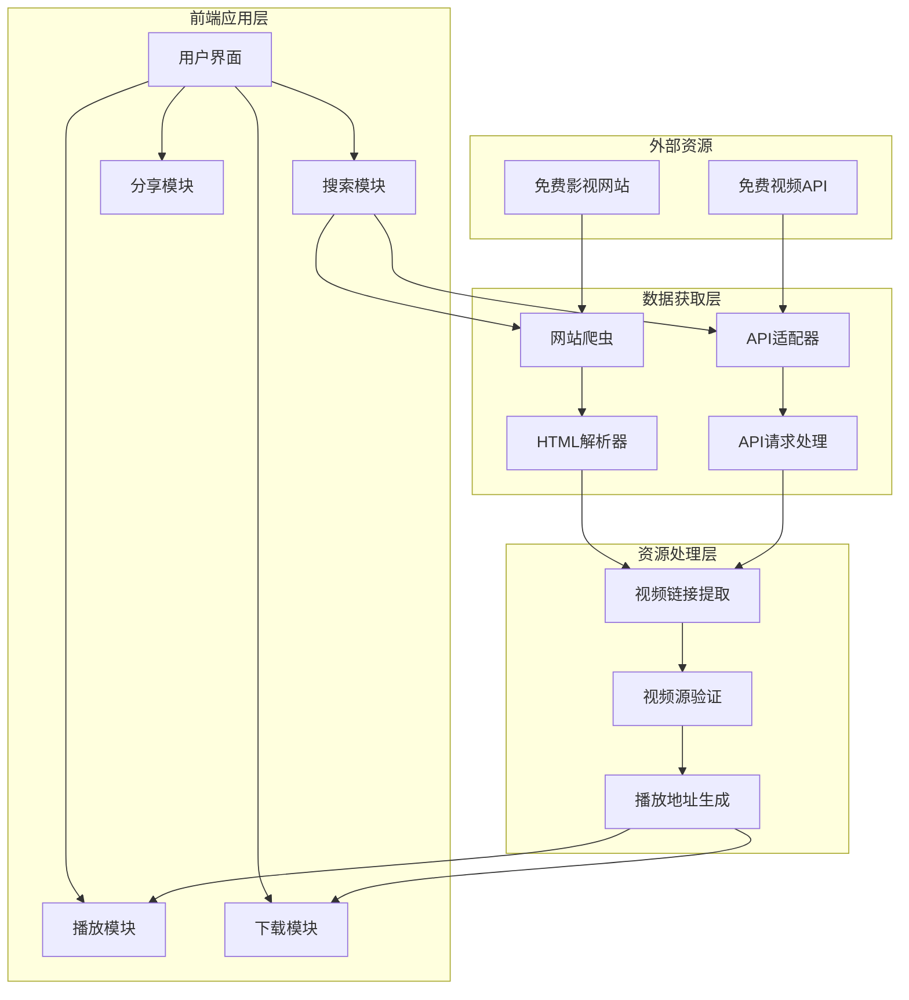

# 免费视频流媒体网页应用技术设计

Feature Name: free-video-streaming
Updated: 2026-06-03

## Description

一个纯前端的免费视频流媒体网页应用，通过爬取免费影视动漫网站资源并融合免费API，为用户提供视频搜索、播放和下载功能。应用适配安卓手机和Windows平台，支持网页分享，包含免责声明仅供学习使用。

## Architecture

### 系统架构图



### 技术架构说明

1. **前端框架**: 使用原生HTML5/CSS3/JavaScript，确保轻量级和兼容性
2. **模块化设计**: 各功能模块独立，便于维护和扩展
3. **跨域处理**: 采用多种策略组合解决跨域问题
4. **响应式布局**: 适配不同屏幕尺寸，优先移动端体验

## Components and Interfaces

### 1. 搜索模块 (SearchModule)

**职责**: 处理用户搜索请求，聚合多个资源网站结果

**接口**:
```javascript
class SearchModule {
  // 搜索视频
  async search(keyword, sources = [])
  
  // 获取搜索结果
  getResults()
  
  // 切换数据源
  switchSource(sourceId)
}
```

**数据源配置**:
```javascript
const videoSources = [
  {
    id: 'source1',
    name: '免费影视网站A',
    type: 'crawl', // 爬取类型
    url: 'https://example.com',
    searchPath: '/search?q=',
    enabled: true
  },
  {
    id: 'source2', 
    name: '免费API服务',
    type: 'api', // API类型
    url: 'https://api.example.com',
    apiKey: '',
    enabled: true
  }
]
```

### 2. 网站爬虫 (WebCrawler)

**职责**: 爬取免费影视网站内容，提取视频信息

**接口**:
```javascript
class WebCrawler {
  // 爬取搜索页面
  async crawlSearchPage(url, keyword)
  
  // 解析HTML内容
  parseHTML(html)
  
  // 提取视频链接
  extractVideoLinks(document)
  
  // 处理分页
  async handlePagination(url)
}
```

**HTML解析策略**:
- 使用DOMParser解析HTML
- CSS选择器定位视频元素
- 正则表达式提取视频URL
- 处理相对路径转换绝对路径

### 3. API适配器 (APIAdapter)

**职责**: 对接免费视频API服务

**接口**:
```javascript
class APIAdapter {
  // 调用搜索API
  async searchAPI(keyword, apiConfig)
  
  // 获取视频详情
  async getVideoDetail(videoId)
  
  // 获取播放地址
  async getPlayUrl(videoId, episode)
}
```

### 4. 播放模块 (PlayerModule)

**职责**: 管理视频播放功能

**接口**:
```javascript
class PlayerModule {
  // 初始化播放器
  initPlayer(container, options)
  
  // 播放视频
  play(videoUrl)
  
  // 暂停播放
  pause()
  
  // 设置音量
  setVolume(volume)
  
  // 跳转进度
  seekTo(time)
  
  // 切换清晰度
  switchQuality(quality)
}
```

**支持格式**:
- MP4 (H.264/H.265)
- HLS (m3u8)
- FLV (通过flv.js)
- WebM

### 5. 下载模块 (DownloadModule)

**职责**: 处理视频下载功能

**接口**:
```javascript
class DownloadModule {
  // 获取下载链接
  async getDownloadUrl(videoUrl)
  
  // 开始下载
  startDownload(url, filename)
  
  // 显示下载进度
  showProgress(progress)
  
  // 取消下载
  cancelDownload()
}
```

**下载策略**:
- 直接链接下载
- Blob对象下载
- 浏览器内置下载
- 分片下载（大文件）

### 6. 跨域处理模块 (CORSModule)

**职责**: 解决跨域访问问题

**解决方案组合**:
```javascript
const corsStrategies = [
  {
    name: 'CORS代理',
    type: 'proxy',
    urls: [
      'https://cors-anywhere.herokuapp.com/',
      'https://api.allorigins.win/raw?url='
    ]
  },
  {
    name: 'JSONP',
    type: 'jsonp',
    support: true
  },
  {
    name: '浏览器扩展',
    type: 'extension',
    available: false
  }
]
```

### 7. 分享模块 (ShareModule)

**职责**: 处理网页分享功能

**接口**:
```javascript
class ShareModule {
  // 生成分享链接
  generateShareLink(videoId, params)
  
  // 复制到剪贴板
  copyToClipboard(text)
  
  // 生成分享卡片
  generateShareCard(videoInfo)
  
  // 调用系统分享
  invokeSystemShare(data)
}
```

## Data Models

### 1. 视频信息模型 (VideoInfo)

```javascript
{
  id: string,           // 视频唯一标识
  title: string,        // 视频标题
  cover: string,        // 封面图片URL
  description: string,  // 描述信息
  year: string,         // 年份
  type: string,         // 类型：电影/电视剧/动漫
  sources: [            // 视频源列表
    {
      sourceId: string,
      url: string,      // 播放页面URL
      episodes: [       // 剧集列表
        {
          name: string, // 剧集名称
          url: string   // 播放地址
        }
      ]
    }
  ]
}
```

### 2. 搜索结果模型 (SearchResult)

```javascript
{
  keyword: string,      // 搜索关键词
  results: [VideoInfo], // 搜索结果列表
  total: number,        // 总结果数
  page: number,         // 当前页码
  hasMore: boolean,     // 是否有更多结果
  sources: [            // 数据源状态
    {
      sourceId: string,
      status: string,   // success/error/loading
      count: number     // 该源结果数
    }
  ]
}
```

### 3. 播放状态模型 (PlayState)

```javascript
{
  videoId: string,      // 当前播放视频ID
  url: string,          // 当前播放URL
  currentTime: number,  // 当前播放时间
  duration: number,     // 总时长
  playing: boolean,     // 是否正在播放
  volume: number,       // 音量 0-1
  quality: string,      // 当前清晰度
  qualities: [string],  // 可用清晰度列表
  error: string         // 错误信息
}
```

## Correctness Properties

### 1. 搜索功能正确性

- **搜索结果一致性**: 相同关键词在相同数据源下应返回相同结果
- **错误处理完整性**: 网络错误、解析错误、超时等异常情况必须有明确提示
- **数据源隔离**: 单个数据源失败不影响其他数据源结果

### 2. 播放功能正确性

- **播放地址有效性**: 获取的播放地址必须可访问且格式支持
- **播放状态一致性**: 播放/暂停/进度等状态必须与用户操作一致
- **格式兼容性**: 支持主流视频格式，不支持格式应给出明确提示

### 3. 下载功能正确性

- **下载链接有效性**: 提供的下载链接必须可访问
- **文件完整性**: 下载文件必须完整可用
- **进度显示准确性**: 下载进度显示必须准确反映实际进度

### 4. 跨平台兼容性

- **安卓适配**: 在主流安卓浏览器上功能正常
- **Windows兼容**: 在Chrome、Firefox、Edge等浏览器上功能正常
- **响应式布局**: 不同屏幕尺寸下布局合理可用

## Error Handling

### 1. 网络错误处理

```javascript
// 网络请求错误处理
async function fetchWithRetry(url, options, retries = 3) {
  for (let i = 0; i < retries; i++) {
    try {
      const response = await fetch(url, options)
      if (!response.ok) throw new Error(`HTTP ${response.status}`)
      return response
    } catch (error) {
      if (i === retries - 1) throw error
      await delay(1000 * (i + 1)) // 指数退避
    }
  }
}
```

### 2. 跨域错误处理

```javascript
// 跨域请求降级策略
async function fetchWithCORSFallback(url) {
  const strategies = [
    () => fetch(url), // 直接请求
    () => fetch(corsProxy + url), // CORS代理
    () => jsonpRequest(url) // JSONP
  ]
  
  for (const strategy of strategies) {
    try {
      return await strategy()
    } catch (error) {
      continue
    }
  }
  throw new Error('所有跨域策略失败')
}
```

### 3. 视频播放错误处理

```javascript
// 视频播放错误处理
function handleVideoError(error) {
  const errorMessages = {
    'MEDIA_ERR_ABORTED': '视频播放被中止',
    'MEDIA_ERR_NETWORK': '网络错误，请检查网络连接',
    'MEDIA_ERR_DECODE': '视频解码失败，格式可能不支持',
    'MEDIA_ERR_SRC_NOT_SUPPORTED': '视频源不支持，请尝试其他源'
  }
  
  showError(errorMessages[error.code] || '视频播放失败')
  showAlternativeSources() // 显示备用源
}
```

## Test Strategy

### 1. 单元测试

**测试框架**: Jest

**测试覆盖**:
- 搜索模块：关键词处理、结果解析、错误处理
- 爬虫模块：HTML解析、链接提取、分页处理
- API适配器：请求构造、响应解析、错误处理
- 播放模块：状态管理、事件处理、格式支持
- 下载模块：链接生成、进度跟踪、错误处理

### 2. 集成测试

**测试场景**:
- 完整搜索流程：输入关键词 → 获取结果 → 显示列表
- 视频播放流程：选择视频 → 获取源 → 开始播放
- 下载流程：获取链接 → 开始下载 → 完成下载

### 3. 兼容性测试

**测试环境**:
- 安卓：Chrome、Firefox、Samsung Internet、微信内置浏览器
- Windows：Chrome、Firefox、Edge、Safari
- 屏幕尺寸：320px、375px、414px、768px、1024px、1920px

### 4. 性能测试

**测试指标**:
- 首次加载时间 < 3秒
- 搜索响应时间 < 5秒
- 视频加载时间 < 10秒
- 内存使用 < 100MB

## Security Considerations

### 1. 内容安全

- **XSS防护**: 对用户输入和外部内容进行转义处理
- **CSP策略**: 设置内容安全策略限制资源加载
- **链接验证**: 验证视频链接的合法性和安全性

### 2. 隐私保护

- **本地存储**: 仅存储必要数据，不收集用户隐私
- **无跟踪**: 不添加任何用户行为跟踪代码
- **透明性**: 明确告知用户数据使用方式

### 3. 法律合规

- **免责声明**: 在网页底部显示"仅供学习，拒绝商业用途"声明
- **版权提示**: 提醒用户尊重版权，支持正版
- **内容过滤**: 不存储或分发任何违法内容

## Deployment

### 1. 静态部署

应用为纯静态文件，可部署到任何静态文件服务器：
- GitHub Pages
- Netlify
- Vercel
- 本地文件系统

### 2. 文件结构

```
free-video-streaming/
├── index.html          # 主页面
├── css/
│   ├── style.css      # 主样式
│   └── responsive.css # 响应式样式
├── js/
│   ├── app.js         # 应用入口
│   ├── modules/       # 功能模块
│   └── utils/         # 工具函数
├── assets/
│   ├── images/        # 图片资源
│   └── icons/         # 图标资源
└── README.md          # 项目说明
```

### 3. 构建优化

- **代码压缩**: HTML/CSS/JS文件压缩
- **图片优化**: 图片压缩和格式转换
- **缓存策略**: 设置合理的缓存头
- **CDN加速**: 使用CDN加速静态资源加载

## References

[^1]: MDN Web Docs - Fetch API - https://developer.mozilla.org/zh-CN/docs/Web/API/Fetch_API
[^2]: MDN Web Docs - HTMLVideoElement - https://developer.mozilla.org/zh-CN/docs/Web/API/HTMLVideoElement
[^3]: MDN Web Docs - Responsive Design - https://developer.mozilla.org/zh-CN/docs/Learn/CSS/CSS_layout/Responsive_Design